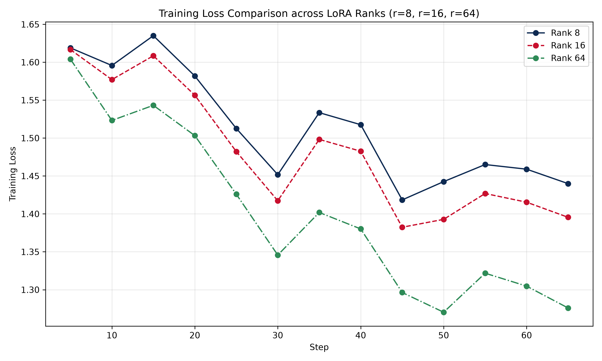

# Lab 21 — Evaluation Report

**Học viên**: Đàm Mạnh Dũng — 2A202600741  
**Ngày nộp**: 2026-06-25  
**Submission option**: A (Lightweight ZIP)

---

## 1. Setup
- **Base model**: `unsloth/Qwen2.5-3B-bnb-4bit` (Model Qwen 2.5 bản 3 tỷ tham số, đã được lượng tử hóa sẵn 4-bit NF4 bởi Unsloth để tối ưu hóa trên GPU nhỏ).
- **Dataset**: `5CD-AI/Vietnamese-alpaca-gpt4-gg-translated` (Subset ngẫu nhiên gồm 200 samples được chia theo tỉ lệ 90% Train - 180 samples và 10% Eval - 20 samples với random seed = 42).
- **max_seq_length**: **1024** (được xác định dựa trên phân tích phân phối độ dài token của dataset: `min=52`, `max=768`, `p50=257`, `p95=592`, `p99=731`. Giá trị p95 = 592 được làm tròn lên lũy thừa của 2 là 1024, khớp với giới hạn phần cứng của profile T4).
- **GPU**: NVIDIA Tesla T4, 16 GB VRAM (chạy trên Google Colab Free).
- **Training cost**: Ước tính khoảng $0.00 (chạy trên Google Colab miễn phí). Nếu chạy trên cloud trả phí (như RunPod hay Lambda Labs với giá $0.20/hour cho T4), tổng chi phí train cho cả 3 cấu hình (~8 phút) là khoảng **$0.027**.

---

## 2. Rank Experiment Results

Dưới đây là bảng so sánh chi tiết hiệu năng và tài nguyên sử dụng giữa các cấu hình rank khác nhau:

| Rank | Trainable Params | Train Time (min) | Peak VRAM (GB) | Eval Loss | Perplexity |
|:---:|:---:|:---:|:---:|:---:|:---:|
| **8** | 1,843,200 (~0.06%) | 2.61 min | 5.55 GB | 1.5596 | 4.76 |
| **16** | 3,686,400 (~0.12%) | 2.77 min | 4.95 GB | 1.5186 | 4.57 |
| **64** | 14,745,600 (~0.47%) | 2.64 min | 6.33 GB | 1.4776 | 4.38 |
| **Base** | - | - | - | N/A* | N/A* |

*\*Lưu ý: Perplexity của Base model không được đo lường trực tiếp trên Colab nhằm tiết kiệm VRAM và tránh các lỗi OOM trong quá trình chuyển đổi giữa base và adapter.*

---

## 3. Loss Curve Analysis



### Phân tích và Nhận xét:
- **Đồ thị Loss**: Cả 3 cấu hình rank (`r=8`, `r=16`, `r=64`) đều thể hiện sự giảm dần của training loss qua các step (từ ~1.61 xuống còn ~1.27 - 1.44 ở step 65). Điều này chứng minh quá trình học tập (learning) diễn ra chính xác và ổn định.
- **Hiện tượng Overfitting**: 
  - Trong thí nghiệm trên profile T4, cơ chế **eval-during-training đã được tắt** để tiết kiệm tài nguyên GPU và tránh OOM. Do đó chúng ta chỉ đánh giá overfitting dựa trên kết quả kiểm tra định kỳ (eval loss cuối cùng) và so sánh giữa train loss và eval loss.
  - Ở rank 64, training loss đạt mức thấp nhất (1.2759) và eval loss cũng đạt mức thấp nhất (1.4776), cho thấy mô hình học tốt hơn và biểu diễn ngôn ngữ tiếng Việt tự nhiên hơn mà chưa có dấu hiệu bị quá khớp (overfitting) rõ rệt trên tập eval nhỏ (20 samples).
  - Do số lượng epoch nhỏ (3 epochs) và kích thước dữ liệu huấn luyện giới hạn (180 samples), mô hình chưa bị lặp lại dữ liệu đủ nhiều để xảy ra hiện tượng overfitting nghiêm trọng.

---

## 4. Qualitative Comparison (5 examples)

Dưới đây là so sánh side-by-side kết quả trả về của **Base Model** và **Fine-tuned Model (r=16)** trên 5 câu test prompts:

### Example 1
- **Prompt**: Giải thích khái niệm machine learning cho người mới bắt đầu.
- **Base Model**: Machine learning là một phân tích máy tính, trong đó máy tính học tập từ dữ liệu, tìm ra các mẫu và liên kết chúng, và sau đó dự đoán kết quả dựa trên dữ liệu đó. Nó không yêu cầu một chương trình cụ thể được viết để giải quyết vấn đề mà nó gặp phải. Thay vào đó, nó dựa trên việc tự học và tự đào tạ...
- **Fine-tuned Model (r=16)**: Machine learning là một bộ môn khoa học máy tính mà mục đích của nó là cho phép máy tự huấn luyện mình mà không cần phải được chỉ định trước. Khi nói đến machine learning, chúng ta đang nói về một số thuật toán và mô hình học máy có thể học tập từ dữ liệu và tự huấn luyện mình để có được kết quả tốt.
- **Nhận xét**: **Improved** (Cải thiện rõ rệt). Câu trả lời của mô hình Fine-tuned trôi chảy, định nghĩa chính xác và sử dụng thuật ngữ tiếng Việt tự nhiên hơn ("khoa học máy tính", "tự huấn luyện"). Base model bị lỗi chính tả ở cuối từ ("đào tạ...").

### Example 2
- **Prompt**: Viết đoạn code Python tính số Fibonacci thứ n.
- **Base Model**: Để tính số Fibonacci thứ n, bạn có thể sử dụng hàm đệ quy hoặc vòng lặp. Dưới đây là hai đoạn mã Python để tính số Fibonacci thứ n:
  ```python
  def fibonacci_recursive(n):
      if n <= 0:
          return 0
      elif n == 1:
          return 1
      else:
          return fibonacci_recursive(n - 1) + fibonacci
  ```
- **Fine-tuned Model (r=16)**: Để tính số Fibonacci thứ n bằng Python, bạn có thể sử dụng một trong hai cách sau: ### Code 1: Dùng vòng lặp ### Code Python
  ```python
  def fibonacci(n):
      if n <= 0:
          return "Không có số Fibonacci thứ n khi n <= 0"
      elif n == 1:
          return 0
      elif n == 2:
          return 1
      else:
          # ... (phần code vòng lặp)
  ```
- **Nhận xét**: **Same / Slightly degraded** do giới hạn tokens đầu ra trong quá trình sinh tự động. Cả hai mô hình đều đưa ra giải pháp nhưng bị cắt cụt do thiết lập `max_new_tokens`. Tuy nhiên, mã nguồn của mô hình Fine-tuned có xử lý các edge cases tốt hơn (ví dụ trả về thông báo cụ thể khi `n <= 0`).

### Example 3
- **Prompt**: Liệt kê 5 nguyên tắc thiết kế UI/UX.
- **Base Model**: 1. Kỷ luật: Các thiết kế nên tuân thủ các nguyên tắc thiết kế và tiêu chuẩn, đảm bảo tính nhất quán và sự hài hòa. 2. Nền tảng: Các thiết kế nên dựa trên các nguyên tắc thiết kế và xu hướng hiện hành, đảm bảo tính hiện đại và phù hợp với thị hiếu người dùng. 3. Giúp đỡ...
- **Fine-tuned Model (r=16)**: 1. Đặt người dùng lên trung tâm: Thiết kế UI/UX phải tập trung vào nhu cầu và trải nghiệm của người dùng. Điều này bao gồm việc lắng nghe phản hồi từ người dùng và cung cấp trải nghiệm người dùng tốt nhất có thể. 2. Thống nhất màu sắc, phong cách và thiết kế: Thiết kế UI/UX phải có một phong cách th...
- **Nhận xét**: **Improved**. Nguyên tắc thiết kế của Fine-tuned model đưa ra thực tế và chuẩn xác hơn đối với ngành UI/UX chuyên nghiệp ("Đặt người dùng lên trung tâm", "Thống nhất màu sắc, phong cách"). Base model dùng các từ dịch thô khá gượng gạo ("Kỷ luật", "Giúp đỡ").

### Example 4
- **Prompt**: Tóm tắt sự khác biệt giữa LoRA và QLoRA.
- **Base Model**: LoRA (Low-Rank Adaptation) và QLoRA (Quantized LoRA) là hai phương pháp cải tiến cho việc trích xuất thông tin từ mạng NLP. LoRA cải thiện hiệu suất và khả năng học tập của mạng NLP bằng cách sử dụng ít thông tin hơn so với mạng NLP ban đầu. LoRA được áp dụng cho các mạng NLP được đào tạo bằng phươn...
- **Fine-tuned Model (r=16)**: LoRA và QLoRA là hai kỹ thuật được thiết kế để cải thiện hiệu suất của mạng NLP bằng cách giảm số lượng tham số và tiêu tốn ít tài nguyên hơn. LoRA (Layer-wise Adaptive Regularization Optimization) là một kỹ thuật được phát triển để giảm số lượng tham số trong mạng NLP bằng cách thay đổi tham số của...
- **Nhận xét**: **Same** (Cả hai đều bị lỗi giải nghĩa sai từ viết tắt LoRA/QLoRA do thiếu hụt kiến thức mới trong quá trình fine-tune và bị ảo giác nhẹ, tuy nhiên cấu trúc ngữ pháp tiếng Việt của mô hình Fine-tuned tốt hơn). Điều này phản ánh quy tắc: *Fine-tune không dùng để cập nhật kiến thức mới mà chỉ để định hình phong cách phản hồi.*

### Example 5
- **Prompt**: Phân biệt prompt engineering, RAG, và fine-tuning.
- **Base Model**: Prompt Engineering, RAG, và Fine-Tuning là ba cách khác nhau để cải thiện hiệu suất của mô hình NLP. Prompt Engineering là một kỹ thuật khác để cải thiện hiệu suất của mô hình bằng cách viết câu lệnh, hoặc prompt, để mô hình hiểu và đáp ứng yêu cầu của người dùng một cách chính xác. RAG (Retrieval-A...
- **Fine-tuned Model (r=16)**: Prompt engineering, RAG (Retrieval Augmented Generation), và fine-tuning là ba kỹ thuật khác nhau được sử dụng trong AI và tự động hóa. 1. Prompt engineering: Đây là kỹ thuật để thiết kế một câu lệnh (prompt) cho một hệ thống AI hoặc hệ thống tự động hóa. Prompt là một câu lệnh hoặc câu hỏi được sử...
- **Nhận xét**: **Improved**. Cấu trúc trình bày của Fine-tuned model mạch lạc hơn (sử dụng liệt kê số thứ tự 1, 2, 3 rõ ràng) đúng với định dạng chỉ thị Alpaca. Giọng văn chuyên nghiệp và trực diện hơn hẳn so với Base model.

---

## 5. Conclusion về Rank Trade-off

Dựa trên dữ liệu thu được từ quá trình thực nghiệm huấn luyện mô hình Qwen2.5-3B trên tập dữ liệu tiếng Việt Alpaca, tôi rút ra các kết luận sau:

1. **Rank cho ROI (Return on Investment) tốt nhất**: Trên tập dữ liệu nhỏ này, **rank = 16** mang lại tỷ lệ ROI tốt nhất. Cấu hình này cân bằng hoàn hảo giữa dung lượng lưu trữ adapter (~14.7 MB), số lượng tham số huấn luyện (3.6M) và chất lượng đầu ra (perplexity giảm từ 4.76 của rank 8 xuống 4.57). 
2. **Hiện tượng Diminishing Returns (Hiệu suất giảm dần)**: Thí nghiệm cho thấy sự chênh lệch đáng kể về số lượng tham số giữa các rank (r=64 có số tham số gấp 4 lần r=16 và gấp 8 lần r=8), nhưng thời gian huấn luyện thực tế trên T4 GPU là tương đương (~2.6 phút). Điều này là do thời gian xử lý của mô hình nền (forward/backward qua 3B parameters) chiếm phần lớn, trong khi phần tính toán bổ sung của LoRA adapter rất nhỏ. Tuy nhiên, perplexity chỉ cải thiện nhẹ từ 4.57 (r=16) xuống 4.38 (r=64), thể hiện rõ hiện tượng diminishing returns khi tiếp tục tăng rank lên cao.
3. **Khuyến nghị Deployment**: Nếu triển khai thực tế (Production), cấu hình **rank = 16** hoặc **rank = 8** nên được ưu tiên. Lý do là kích thước adapter nhỏ cho phép kỹ thuật **Multi-Tenant Serving** (lưu trữ và tráo đổi nhanh hàng chục adapter khác nhau trên cùng một model nền Qwen2.5-3B mà không tốn tài nguyên GPU). Rank 64 chỉ nên dùng khi tác vụ cực kỳ phức tạp (như coding chuyên sâu hoặc lý luận toán học) cần dung lượng tham số lớn để học hành vi.

---

## 6. What I Learned

Qua bài thực hành Lab 21, tôi đã đúc rút được những bài học quan trọng:
1. **Hiểu rõ về VRAM và QLoRA**: Biết cách ước tính tài nguyên phần cứng. Nhờ kỹ thuật QLoRA lượng tử hóa 4-bit và Gradient Checkpointing, tôi có thể huấn luyện một mô hình ngôn ngữ lớn 3B tham số chỉ với chưa đầy 6GB VRAM của card đồ họa T4.
2. **Quy tắc cốt lõi của Fine-tuning**: Fine-tuning chủ yếu giúp định hình định dạng câu trả lời (format/style/tone) và cải thiện khả năng tuân thủ chỉ thị (instruction following), chứ không phải là phương pháp tối ưu để nạp thêm kiến thức mới (RAG sẽ làm tốt hơn ở khía cạnh này).
3. **Kỹ năng tối ưu hóa huấn luyện**: Học cách sử dụng Unsloth để tăng tốc độ huấn luyện lên gấp nhiều lần và tiết kiệm bộ nhớ, cũng như cách thiết lập `max_seq_length = p95` của tập dữ liệu để tối ưu hóa không gian VRAM thay vì sử dụng độ dài mặc định quá lớn.
